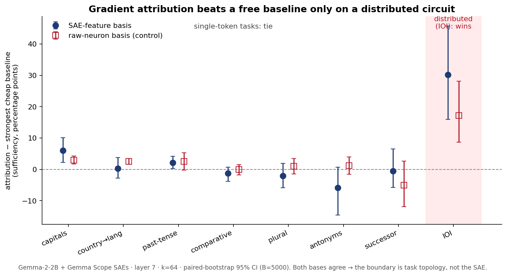
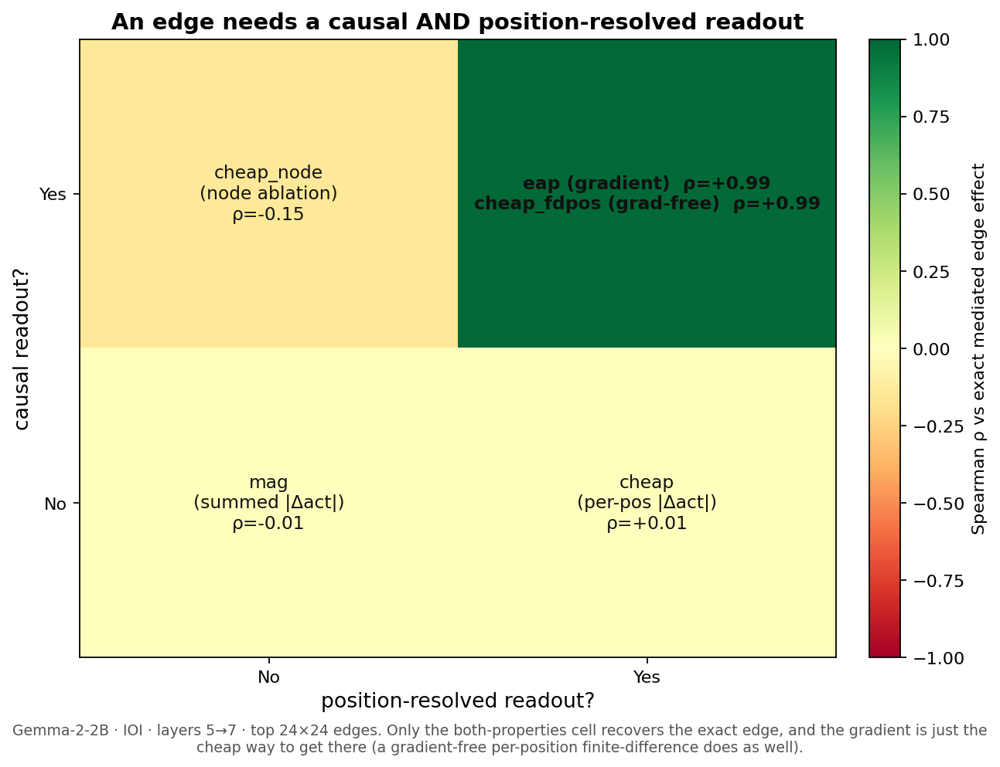
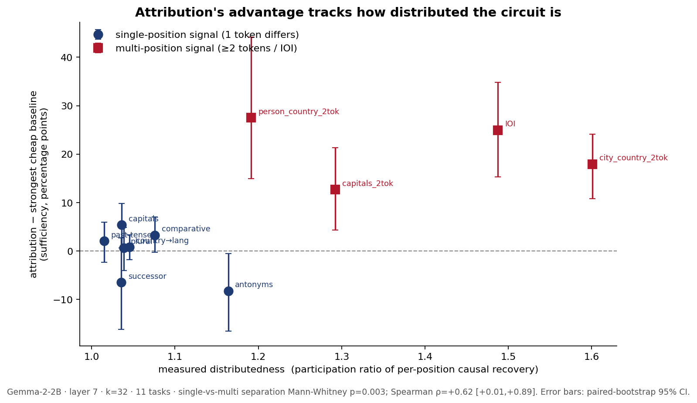

# nanofeatures

**When does expensive causal attribution actually beat a free baseline for finding SAE-feature circuits?**

Only when the circuit is distributed across positions. On single-token tasks a gradient-free
peak-change heuristic matches it; on IOI, attribution wins by 15–45pp. This is that boundary,
with calibrated error bars.

A small, calibrated study of feature-level circuit discovery on a real model
(Gemma-2-2B + Gemma Scope SAEs). It is the Phase-2 successor to
[`nanocircuits`](https://github.com/jlov7/nanocircuits), whose hardest lesson was that "causal attribution beats
baseline" can be true for the wrong reason. You have to calibrate against the strongest
*cheap* baseline you can build, not a convenient weak one. nanofeatures takes that one level
up, to SAE features on a real model with behavioral faithfulness. The result is not a flat
"attribution is unnecessary." It is a boundary: the gradient buys nothing when the
contrastive signal sits at one token position, and a lot when it spreads across positions
with path cancellation. Push to cross-layer *edges* and the picture sharpens: ranking edges
faithfully needs a readout that is both *causal and position-resolved* (the gradient supplies it
in one backward pass; a gradient-free finite-difference supplies the same thing in n_pos
forwards), while the cached / no-extra-forward scores fail, on two models and three layer
distances, and that advantage pays off behaviorally exactly where the circuit is distributed (M14).

Everything runs on one M4 Max. No GPU cluster, a few hundred lines of method.

> The argument that ties both repos together (calibrate against the strongest cheap
> baseline, and measure your oracle rather than assuming it) is in [`THESIS.md`](THESIS.md).
> There's a narrative, post-ready version in [`WRITEUP.md`](WRITEUP.md).

---

## TL;DR, in one picture



Sufficiency of the top-k SAE features chosen by each rule, with paired-bootstrap 95% CIs.
"attribution − cheap" is the gap over `diff_mag_max`, the strongest gradient-free baseline.

| regime | tasks | attribution − cheap peak-change | reading |
|--|--|--|--|
| **single differing position** | capitals, country→language, antonyms, past-tense, comparative, plural, successor (7) | no meaningful advantage (TOST below); all wins ≤6pp | the gradient buys ~nothing |
| **distributed, multi-position** | IOI (subject repeated; path cancellation) | **+15 to +45pp, 12/12** cells, every CI excludes 0 | the gradient is essential |

**The single-token "tie", tested properly (TOST, not just non-significance).** Calling a cell a
"tie" because its CI crosses 0 is absence of evidence, not equivalence. So we ran a two-one-sided
equivalence test against a *pre-registered* `diff_mag_max` (margin δ=5pp, well under the 15pp IOI
floor) on all 63 single-token cells (`run_equivalence`). The honest four-way verdict: **10
attribution-wins (all small, ≤6pp), 13 statistically equivalent (within 5pp), 4 cheap-baseline
wins (antonyms), 36 inconclusive at this n.** So attribution never wins by a meaningful margin on
single-token tasks, sometimes loses, and is provably equivalent in a fifth of cells; the rest are
too close to call at n≤30. That is a much weaker statement than the IOI win, which is exactly the
point. (`reports/m20_equivalence.json`.)

## The structural result, in one picture

The boundary above is about *when* the gradient is worth it. Push to cross-layer **edges** and you
get a sharper, more general statement about *what an edge attribution score has to be*. Every
candidate edge score factors as `transfer × readout` over the same exactly-measured transfer, so
they differ only in the readout. Race them against the exact mediated edge effect and a clean 2×2
falls out: a faithful edge score needs a readout that is **both causal and position-resolved**.
The gradient (`eap`) has both; so does a gradient-free per-position finite-difference
(`cheap_fdpos`); drop either property and the score fails (position-blind magnitude ≈ 0;
position-collapsed node-ablation is *anti*-correlated). The gradient is not special, its two
*properties* are, and you can get them without it.



This is the most novel piece here: not "use the gradient" but a decomposition of what edge
attribution measures, with a constructive gradient-free proof. (Details and the layer-pair /
second-model replications in the edges section below.)

It isn't a binary cliff either. It's a dichotomy you can predict from the task. Across 11
tasks, every task whose contrastive signal spans more than one token position
(2-token-subject recall, IOI) shows attribution winning (gap +13 to +28pp), and every
single-position task ties (gap ≤+5pp). That is a perfect categorical separation, Mann-Whitney
one-sided p=0.003 (`run_distributedness`). In full honesty, "distributed" is correlated
with sample size across this task set, a confound we test directly below (it is topology, not n;
`run_nsweep`).



On single-token tasks the ladder is
`magnitude ≈ random (~0) << diff_mag (summed) << diff_mag_max ≈ attribution ≈ exact causal`,
and the top three rungs are statistically indistinguishable. On IOI it spreads apart:
`random (~0) << diff_mag (summed, +20%) << diff_mag_max (+60%) << attribution (+90%) ≲ exact`.

Why does the boundary exist? `diff_mag_max` ranks a feature by its peak per-position change
|f_clean − f_corrupt|, so it's blind to *which* position the readout actually reads from.
When the whole task signal is one token swap (the capital, the antonym), the biggest-change
feature is also the relevant one, so the position-blind heuristic ties the gradient. On IOI
the biggest activation change sits at a name position the final-token logit barely reads.
Only a method that propagates the readout, the gradient or exact ablation, ranks the
causally relevant features first. So the useful question isn't "is attribution worth it?"
It's "is your circuit distributed?", and you can answer that in advance.

---

## Four calibrated findings

1. **The cheap baseline you pick decides the apparent result.** Rank features by *summed*
   |Δact| over positions (the natural choice) and attribution looks decisive, beating it by
   17–35pp on factual recall at layer 7. Rank instead by *peak* per-position |Δact|
   (`diff_mag_max`, just as gradient-free) and almost all of that gap closes. The summed
   baseline is a strawman; the peak one is the honest competitor. Across all 63 single-token
   cells the attribution−summed gap ranges −8 to +57pp, so even the strawman sometimes ties.
   Report the distribution, not one flattering cell.

2. **On single-token tasks, gradient attribution has no meaningful advantage over a
   gradient-free heuristic.** Tested properly with a pre-registered TOST against `diff_mag_max`
   (margin δ=5pp; see the TL;DR), the 63 task×layer×k cells split 10 small attribution-wins
   (all ≤6pp), 13 statistical equivalences, 4 cheap-baseline wins (antonyms), and 36
   inconclusive at this n. So attribution sometimes wins by a hair, sometimes loses, and is
   provably equivalent in a fifth of cells; none of it approaches the IOI effect. The honest
   read: on these tasks the expensive machinery is mostly unnecessary, and we say so with an
   equivalence test rather than by reading it off non-significance. (`reports/m20_equivalence.json`.)

3. **On a distributed circuit (IOI), attribution wins decisively.** Same ladder, same
   bootstrap: attribution beats `diff_mag_max` at 12/12 cells (layers 5/7/9/11, k∈{16,32,64})
   by +15 to +45pp, every CI well clear of zero. This is the experiment a reviewer demanded,
   to check whether finding 2 was just an artifact of easy tasks. It was. The negative result
   is scoped to single-position signal.

4. **Where you do use attribution, the cheap gradient matches the expensive ablation.** Exact
   per-feature ablation beats the 1-backward-pass AtP approximation in 3/21 single-token cells
   and 3/12 IOI cells, all small (≤7pp) and at higher k. Otherwise AtP ≈ exact. So if you
   reach for attribution you almost never need exact ablation. This part replicates AtP\* on
   SAE features and extends it to a distributed circuit.

Nothing here claims "we found the circuit." Every claim is about calibration: which selection
rule yields faithful circuits, by how much, with what error bars, and (the contribution)
under what circuit topology the answer flips.

---

## Why faithfulness here can't be a structural artifact (the nanocircuits lesson)

Faithfulness here is behavioral: patch features into a run and read the model's
logit-difference on held-in pairs. A rule can only score well by picking features that
causally carry the task signal. The naive `magnitude` baseline (the highest-activating
features) scores ~0%, because those features (BOS, positional, "this is English") are
identical between clean and corrupt and carry no contrastive signal. We verified that, and a
`random` floor, at ~0% in every cell. So the honest competitors are the diff-magnitude family
(features that *change*), and finding 1 is that the variant you pick is what decides things.

---

## Results in full

Tasks are `(subject, answer)` pairs in a fixed template. Both have to be single Gemma tokens
so every prompt is the same length (position-aligned patching, the nanocircuits PAD lesson),
and each task has to pass a behavior gate: the model prefers the correct answer, and clean is
separated from corrupt. The selection rules, all computed on the same cached activations:

| rule | cost over the baseline | what it ranks by |
|--|--|--|
| `causal` | thousands of forward passes | exact effect of patching each feature clean→corrupt |
| `attribution` | **one backward pass** | gradient linear approx of that effect (AtP) |
| `diff_mag_max` | none (same cache) | **peak** per-position \|f_clean − f_corrupt\| |
| `diff_mag` | none | **summed** \|Δ\| over all positions (the strawman) |
| `diff_mag_subjpos`, `diff_mag_lastpos` | none | \|Δ\| at subject / answer position only |
| `magnitude`, `random` | none | \|f_clean\| / shuffled active features (the floor) |

One caveat on framing: `diff_mag_max` isn't "free vs expensive." It uses the same clean and
corrupt cached activations attribution needs; attribution's only extra cost is a single
backward pass. So the real comparison is gradient vs no-gradient, both contrastive.

### Single-token suite: attribution − `diff_mag_max` sufficiency, layer 7, k=64, B=5000 (`run_suite`)

| task | attribution | `diff_mag_max` | attr − dm_max |
|--|--:|--:|--|
| capitals | 70% | 64% | **+6% [+2, +10]** |
| country_language | 71% | 71% | +0% [−3, +4] |
| past_tense | 86% | 83% | **+2% [+0, +4]** |
| comparative | 87% | 89% | −1% [−4, +1] |
| plural | 67% | 69% | −2% [−6, +2] |
| antonyms | 73% | 80% | −6% [−15, +1] |
| successor | 98% | 98% | −0% [−6, +7] |

Aggregate over all layers {5,7,9}×k: **9/63** cells where attribution wins (CI>0). (Using a
fixed `diff_mag_max` comparator it is 10/63; the headline picks the per-cell *strongest*
cheap baseline, which is `diff_mag_max` in 62/63 cells. That's an adversarial choice that
makes attribution's bar harder, so 9/63 is the conservative count.)

### IOI (distributed): attribution − `diff_mag_max` sufficiency, B=5000 (`run_ioi`)

| layer | k=16 | k=32 | k=64 |
|--|--|--|--|
| 5 | +28 [+12,+52] | +37 [+26,+50] | +45 [+26,+66] |
| 7 | +24 [+15,+35] | +25 [+15,+35] | +30 [+16,+46] |
| 9 | +15 [+4,+26] | +21 [+7,+34] | +27 [+14,+43] |
| 11 | +25 [+17,+37] | +36 [+25,+50] | +42 [+27,+59] |

Every cell is significant. Attribution sufficiency reaches ~90% at k=64 while `diff_mag_max`
plateaus near 50–60%. (IOI n=18; some sufficiency CIs run above 100% because the top-k patch
can overshoot the full-clean metric, which is expected for a ratio.)

### Attribution ≡ exact ablation (`run_suite --exact`, `run_ioi`)

Exact beats AtP (CI>0) in 3/21 single-token cells (antonyms/plural/successor, high k) and
3/12 IOI cells (high k, L9), all ≤7pp. Everywhere else AtP ≈ exact. Replicates AtP\* on SAE
features and extends it to a distributed circuit.

### Basis control: is the boundary about the SAE? (`run_suite --neuron`, `run_ioi --neuron`)

Run the identical ladder in the raw residual-neuron basis (rank and patch residual dimensions
instead of SAE features, at the same hook; `load_neuron_basis`) and the boundary reproduces
exactly: attribution beats the strongest cheap baseline at 9/63 single-token cells (same as
the SAE basis, same factual-recall wins) and 12/12 IOI cells (+7 to +20pp). So the
cheap≈attribution verdict tracks task topology, not the Gemma Scope basis. It isn't the SAE
making single-token selection trivial. (Neuron k∈{64,256,512}: the dense residual needs more
dimensions than the sparse SAE to reach the same sufficiency.)

### The boundary is predictable from the task (M10, `run_distributedness`)

> Note: this is a predictive CUE for single-layer node selection. The sequel (nanoassembly) shows it is not a reliable cheap routing rule for full multi-layer circuits once confusability and depth enter.

Two points (single-token vs IOI) is a coincidence waiting to be explained away. To show the
boundary is a property of the circuit, we add a method-neutral distributedness score per
task: the participation ratio of per-position causal recovery. Patch the full residual at
each position clean→corrupt, measure how much of the metric it recovers, and PR comes out as
the effective number of contributing positions. No SAE, no ranking, so it can't be circular
with the gap. We also add four intermediate multi-token-subject tasks (2-token subjects, so
the signal spans 2 positions). Across 11 tasks (layer 7, k=32):

| group | tasks | attribution − cheap gap |
|--|--|--|
| single-position (signal at 1 token) | capitals, antonyms, country→lang, past-tense, comparative, plural, successor | −8% … **+5%** |
| multi-position (≥2 tokens / IOI) | capitals_2tok, city_country_2tok, person_country_2tok, IOI | **+13%** … +28% |

The separation is perfect: every multi-position gap exceeds every single-position gap
(Mann-Whitney one-sided p=0.003). The continuous score corroborates it (Spearman ρ on PR vs
gap = +0.62 [+0.01, +0.89], Pearson +0.68), but the PR proxy is noisy. `person_country`, for
instance, has low PR but a large gap. So the categorical single-vs-multi split is the
load-bearing claim, not a smooth law. The practical upshot: you can tell in advance, from
whether the contrastive signal is single- or multi-position, whether the gradient is worth
it. (The multi-token tasks are small, n=7–9, and their gap CIs are wide and shown.)

**Is it topology, or just sample size? (M21, `run_nsweep`)** Honest confound: across this task
set every multi-position task is also small-n (Pearson(n, gap) = −0.52), so "the gradient wins on
distributed circuits" could be "the gradient wins when n is small." We decouple them *within* a
task by subsampling to matched n (no new forward passes; resample cached per-row sufficiencies),
holding topology fixed:

| task | n=8 | n=12 | n=16 | n=20 |
|--|--|--|--|--|
| IOI (distributed) | **+22%** | +25% | +26% | n/a |
| capitals (single-token) | +5% | +6% | +7% | +6% |
| past-tense (single-token) | +4% | +4% | +2% | +4% |

Each task's gap is flat in n, and at the *same* n=8 IOI is +22% while the single-token tasks are
+4–5%. If sample size drove the effect, capitals at n=8 would look like IOI; it does not. So the
boundary is set by topology, not by n. (`reports/m21_nsweep.json`.)

### The boundary replicates on a second model (M11, `run_model2`)

The same ladder on **GPT-2-small** + Joseph Bloom's residual SAEs (a different architecture,
scale, and SAE training from Gemma + Gemma Scope) reproduces the boundary almost
number-for-number:

| | single-token tasks | IOI (distributed) |
|--|--|--|
| Gemma-2-2B + Gemma Scope | attribution wins 9/63 | 12/12 (+15..+45pp) |
| GPT-2-small + JB SAEs | attribution wins **10/63** (≤+3pp) | **9/9 (+42..+145pp)** |

So the boundary is a property of circuit topology, not of one model or one SAE family.
(IOI sufficiency runs above 100% on GPT-2-small because the top-k patch overshoots clean, so
the gaps come out large. The point is the clean single-vs-distributed split, replicated.)

### And it holds at 9B scale (M17, `run_scale`)

The capstone for scale generality: the same ladder on **Gemma-2-9B** + Gemma Scope 9B SAEs
(layer 20, loaded in bf16 so 9B fits in 48GB; `load_gemma9b` uses `from_pretrained_no_processing`
for an exact-HF residual the SAE expects). The boundary holds. On four single-token tasks
attribution beats the strongest cheap baseline at only 3/12 cells, all small (+3 to +12pp) with
n.s. and negative cells alongside; on IOI it wins 3/3 by +18 to +40pp, every CI clear of zero.

| model | params | single-token | IOI (distributed) |
|--|--|--|--|
| GPT-2-small + JB SAEs | 124M | tie (10/63, ≤+3pp) | win 9/9 (+42..+145pp) |
| Gemma-2-2B + Gemma Scope | 2.6B | tie (9/63, ≤+6pp) | win 12/12 (+15..+45pp) |
| Gemma-2-9B + Gemma Scope | 9B | tie/small (3/12, ≤+12pp) | win 3/3 (+18..+40pp) |

Three models spanning two orders of magnitude in scale, three SAE families, the same line: the
cheap baseline suffices on single-token signal, the gradient earns its cost on the distributed
circuit. (`reports/m17_gemma9b.json`.)

**Is the bf16 9B result trustworthy, or an artifact of reduced precision?** We re-ran the
identical 9B ladder in fp32 on CPU (`run_scale --dtype fp32`; CPU because fp32 9B is ~36GB and a
GPU run that size risks swapping, and `load_gemma9b` disables parameter grad so the attribution
backward fits) and compared cell by cell (`run_precision_compare`). The result: **15/15 cells
agree on the boundary verdict, every cell within bootstrap noise, max attribution-sufficiency
drift 0.7pp.** bf16 does not distort the node-level 9B numbers, on either side of the boundary
(single-token ties, IOI wins +17/+39/+24pp). The committed bf16 numbers stand.
(`reports/m17_gemma9b_fp32.json`, `reports/m17_precision_compare.json`.) This holds because node
sufficiency effects are large (10 to 90pp); the edge analysis below is a different story.

### Mechanism: why the cheap baseline fails on IOI (M12, `run_mechanism`)

The claim that `diff_mag_max` is position-blind is measured, not asserted. Take the IOI
prompt *"When Karen and Julia went to the store, Julia gave a drink to"* → IO=Karen at pos 2,
subject Julia repeated at pos 4 and 10. The causally-relevant positions, by full-residual
recovery, are the IO name and the second subject mention. Attribution puts 25 of its top 32
features at the IO position (mean position-relevance 1.29, 91% on high-relevance positions).
`diff_mag_max` wastes 11 of 32 on the first Julia, where the activation change is big but the
causal relevance is low (mean 0.77, 62% on-target). The cheap baseline chases the biggest
change; attribution chases the biggest effect on the readout. That's the whole boundary in
one circuit. (`reports/m12_mechanism.json`)

### Does the boundary survive interaction-aware selection? (M13, `run_interactions`)

Every result above ranks features independently and takes the top-k. The strongest objection
to that: greedy single-feature ranking is exactly where a gradient's estimate of feature
*interactions* can't help, so maybe the single-token tie is an artifact of the rule and
attribution would pull ahead if both methods were allowed to exploit interactions. To test
it, we add the interaction-aware gold standard: a greedy-exact circuit that at each step adds
the feature most increasing *joint* sufficiency (one forward pass per candidate), over a
neutral pool (top-64 attribution ∪ top-64 `diff_mag_max`). Layer 7, B=5000.

| task | k=32 greedy | top-k attribution | top-k cheap | greedy − attr | greedy − cheap |
|--|--:|--:|--:|--|--|
| capitals | 54% | 52% | 46% | +2% [−1,+6] n.s. | +7% [+4,+11] |
| antonyms | 66% | 54% | 63% | **+12% [+4,+21]** | +4% [+0,+7] |
| IOI | 71% | 62% | 37% | +9% [−0,+19] n.s. | **+34% [+26,+44]** |

The objection isn't borne out. Accounting for interactions does *not* favour attribution on
single-token tasks. On capitals all three are close; on antonyms the joint oracle beats both
first-order methods and attribution actually trails cheap (attr − cheap = −8% [−17,−1] at
k=32). So the single-token boundary isn't hiding an attribution advantage that joint
selection would reveal. On IOI, though, attribution already tracks the joint oracle (greedy −
attr is n.s.) while cheap lags it badly (+34pp), which is the same story as before from a new
angle: on the distributed circuit the gradient finds the right features, and the cheap
baseline doesn't. The new honest nuance: on some tasks (antonyms) the faithful circuit is
genuinely interaction-heavy, and there a joint method beats both cheap and attribution.
(`reports/m13_interactions.json`)

### Cross-layer edges: the gradient is what ranks them (M14, `run_edges`)

Everything above is about nodes (which single features matter). Circuits are also edges,
which feature at layer L1 feeds which feature at layer L2, and EAP-style edge attribution is
exactly where a gradient is supposed to be indispensable. So this is the real test of the
node-level finding: does "cheap ties the gradient on single-token tasks" survive when the
object of study is the connection?

We define an exact mediated edge effect with no gradient: for an edge u@L1 → d@L2, patch u to
its clean value, read the exact per-position amount that moves d, then move d by exactly that
amount and measure the change in the metric. That is the indirect effect of u on the behavior
routed through d, and it is the gold standard an edge score should recover. Every candidate
score factors as `transfer × readout`, and they all use the *same* exactly-measured
transfer, so they differ only in the readout proxy. That turns the comparison into a clean
question: what kind of readout estimate does an edge need? The ladder (the M7
strawman-avoidance discipline, now for edges):

| readout proxy | score | causal? | position-resolved? |
|--|--|--|--|
| gradient | `eap = transfer · (grad·dec_d)` | yes | yes |
| activation magnitude | `cheap = transfer · Δact_d` | no | yes |
| node ablation | `cheap_node = (Σ transfer) · node_effect_d` | yes | no |
| decoder-weighted, sign-agnostic, transfer-only, mag | (four more free scores) | no | varies |

Recovery of the exact edge (Spearman, paired example-bootstrap B=5000, top 24×24 edges),
across three layer pairs:

| pair | task | EAP (gradient) | strongest gradient-free | EAP − strongest free |
|--|--|--:|--:|--|
| 5→7 | capitals | +0.99 [+0.98,+1.00] | +0.21 (`cheap`) | **+0.78 [+0.67,+0.90]** |
| 5→7 | IOI | +0.99 [+0.98,+1.00] | +0.04 (`transfer_only`) | **+0.97 [+0.90,+1.05]** |
| 3→9 | capitals | +0.99 [+0.98,+1.00] | +0.17 (`cheap`) | **+0.82 [+0.71,+0.94]** |
| 3→9 | IOI | +1.00 [+0.98,+1.00] | −0.02 (`transfer_only`) | **+1.01 [+0.93,+1.09]** |
| 6→7 | capitals | +1.00 [+0.98,+1.00] | +0.28 (`cheap`) | **+0.72 [+0.62,+0.84]** |
| 6→7 | IOI | +0.99 [+0.97,+1.00] | +0.04 (`cheap`) | **+0.95 [+0.81,+1.10]** |

Three things. First, EAP ≈ exact for edges (ρ≈0.99 everywhere). That is the AtP\* fact at the
edge level, and it is *not* a tautology: the mean second-order residual between EAP and exact
is 7–12% and the perturbations are not infinitesimal (mean ‖Δ‖ 0.15–0.56), so EAP is doing
real first-order recovery, not arithmetic identity.

Second, no *cheap* (free) score recovers the exact edge, on either task, at any of the three
layer distances. This is where edges differ from nodes: there is no single-token tie. The
sharpest part is *why*, and it comes out as a clean 2×2 over two readout properties, causal and
position-resolved:

| readout | causal? | position-resolved? | extra cost | ρ vs exact (capitals / IOI) |
|--|:--:|:--:|--|--|
| `mag`, `cheap` (activation magnitude) | no | yes | none (cached) | +0.1..+0.3 / ≈0 |
| `cheap_node` (node ablation) | yes | no | n_d forwards | **−0.21 / −0.15** (anti-correlated) |
| `cheap_fdpos` (finite-difference, gradient-free) | yes | yes | **n_d·n_pos forwards** | **+0.99 / +0.99** |
| `eap` (gradient) | yes | yes | one backward | **+0.99 / +0.99** |


`cheap_fdpos` is *not* compute-cheap (it pays n_d·n_pos extra forwards); it is the control that
proves the finding is a readout *property*, not the analytic gradient. The genuinely free /
cached scores (`mag`, `cheap`) are the ones that fail.

An edge needs a readout that is **both causal and position-resolved**. Drop the causality
(magnitude) or the position-resolution (collapse a causal node ablation to one scalar, which
even flips the sign) and it fails. Keep both and it works, whether you get them from the
analytic gradient in one backward pass (`eap`) or from a gradient-free per-position
finite-difference probe in n_pos forwards (`cheap_fdpos`, eap − fdpos = 0.00, n.s.). So the
claim is not "you need the gradient" but the sharper "you need a causal, position-resolved
readout, and the gradient is the cheap way to get it." Every score here uses the same exactly
measured transfer, so this isolates the readout as the whole story.

Is `cheap_fdpos`'s +0.99 an artifact of the probe step? We swept the finite-difference step
h over {0.25, 0.5, 1, 2} (`run_edges --fdpos-h 0.25 0.5 1 2`): the recovery is +0.99 vs exact
and eap − fdpos = 0.00 (n.s.) at *every* step, on both capitals and IOI. So the gradient-free
finite-difference reads the same causal+position-resolved quantity across an 8× range of step
sizes, not at one tuned h. (`reports/m18_fdpos_hgrid.json`.)

Third (M15, behavioral check), the ranking advantage shows up in behavior on the distributed
circuit. Patch the top-m edges (move each downstream feature by the summed transfer from its
selected parents) and read the recovered logit-difference:

| pair | task | exact-selected | EAP-selected | cheap-selected | EAP − cheap circuit |
|--|--|--:|--:|--:|--|
| 5→7 | IOI (m=144) | +0.06 | +0.06 | +0.03 | **+0.03 [+0.01,+0.06]** |
| 3→9 | IOI (m=144) | +0.06 | +0.06 | −0.00 | **+0.06 [+0.03,+0.10]** (vs mag) |
| 5→7 | capitals (m=144) | +0.02 | +0.02 | +0.02 | +0.00 [+0.00,+0.00] |

On IOI the EAP-selected edge circuit recovers behavior matching the exact-selected ceiling and
significantly beats every gradient-free-selected circuit. On capitals all the edge effects are
tiny (a few hundredths of a logit) and the methods tie behaviorally: the gradient's *ranking*
advantage is real there (it orders all 576 edges correctly) but does not translate into a
behavioral gap, because only a handful of small edges carry signal and the cheap score still
catches those few. So the topology boundary re-appears at the behavioral edge level even though
the ranking result holds everywhere. (Behavioral edge-circuit sufficiency is small in absolute
terms because a single-layer-pair 24×24 edge set is a sliver of the full circuit; that is a
limitation of the behavioral metric, and exactly why the rank-recovery of the exact effect is
the primary measure.)

It replicates on GPT-2-small + JB SAEs (layers 5→7, `--model gpt2`). Rank-recovery: EAP +0.97
(capitals) and +0.92 (IOI), the strongest cheap (cached) score +0.38 and −0.00, gradient ahead
by +0.58 and +0.93, and `cheap_node` anti-correlated again (−0.38, −0.23). GPT-2's edges are
much larger (exact effects up to ~1 logit, vs Gemma's ~0.05), which makes the behavioral check
sharper: on IOI the EAP- and `cheap_node`-selected edge circuits recover ~0.6 logit-difference
while the magnitude-selected circuit goes *negative* (−0.07 to −0.23); on capitals every
causal-or-magnitude method ties high (~0.8). Same two messages as Gemma: a causal readout is
what builds a faithful edge circuit, and the gradient's edge advantage shows up behaviorally
where the circuit is distributed. (`reports/m14_edges_gpt2.json`.)

The combined edge result: ranking cross-layer edges faithfully needs a causal,
position-resolved readout (the gradient supplies it in one backward pass; a gradient-free
finite-difference supplies the same thing in n_pos forwards). No cached / no-extra-forward
score has both properties, on two models and three layer distances, and that advantage pays off
behaviorally where the circuit is distributed. (`reports/m14_edges.json`,
`reports/m14_edges_fdpos.json`.)

**It is not a single-layer-pair effect: the readout law holds for a genuine multi-layer chain
(M22, `run_multihop`).** Real feature circuits are multi-hop paths, so we extended the exact
mediated-effect machinery to a connected 2-hop chain `u@L1 → m@L2 → d@L3`: patch u→clean, read the
induced change in m, patch m by exactly that, read the induced change in d, move d by that, measure
the metric. Every score shares this 2-hop-composed exact transfer and differs only in the final
readout, so it isolates the readout exactly as the single-hop ladder did. The same 2×2 holds, on
both tested chains (5→7→9 and 4→7→10) and both task types:

| readout (causal? / position-resolved?) | capitals ρ vs exact 2-hop | IOI ρ vs exact 2-hop |
|--|--:|--:|
| `eap` gradient (yes / yes) | +0.93..+0.94 | +0.93..+0.98 |
| `cheap_fdpos` gradient-free (yes / yes) | +0.93..+0.94 | +0.93..+0.98 |
| `cheap_mag` magnitude (no / yes) | +0.21..+0.25 | −0.03..+0.09 |
| `cheap_node` node-ablation (yes / no) | −0.14..−0.24 | −0.22..−0.25 |

So the structural law generalizes: an edge needs a causal+position-resolved readout whether it
sits in a single pair or a multi-layer chain, and the gradient-free finite-difference keeps pace
with the gradient across the chain (no composition penalty for the rank-recovery). One honest
nuance: rank-recovery is depth-robust, but eap's *value-scale* fidelity to exact can drift over a
wider span (the 4→10 IOI chain keeps ρ=0.93 yet its linear-fit residual rises), so longer-range
*magnitude* estimates still want the exact effect. (`reports/m22_multihop.json`,
`reports/m22_multihop_4_7_10.json`.)

**Edge validation needs fp32, and locating *why* is itself a result.** All the edge numbers
above are fp32 (the `run_edges` default). Re-running the L5→7 ladder in bf16 (`--dtype bf16`)
collapses everything: EAP vs exact falls from ρ+0.99 to ≈0 (the second-order residual jumps from
0.09–0.12 to 0.93–0.97), `cheap_fdpos` vs exact falls from +0.99 to ≈0, and EAP's advantage over
the strongest cheap score drops from +0.78/+0.97 to +0.09/+0.03 (n.s.). A first guess (and our
first claim) was "the final logit-difference is tiny, so bf16 cancels it", but that cannot be
right: IOI's metric baseline is small (~1.7), its bf16 ulp is ~0.007, and its edge effect (~0.05)
sits ~7× above the noise floor, yet IOI collapses as hard as capitals. So we instrumented each
intermediate in bf16 vs fp32 on CPU (`diag_edge_precision`). The gradient readout is **bf16-robust
(relative error ~0.03)**; the collapse lives in the **`exact` mediated-effect reference and the
`transfer` measurement**, both differences of *near-identical full-network forward passes*
under a tiny added perturbation, so the small induced change is lost (the exact-effect ranking's
Spearman to fp32 falls to +0.2/+0.5). In other words "EAP vs exact collapses" is mostly the
*exact reference* degrading, not EAP. The collapse reproduces on **CPU**, so it is a dtype effect,
not an MPS-kernel artifact. The practical rule: computing or validating cross-layer edge effects
needs fp32, because the gold-standard reference is a fragile perturbation-difference, even though
the gradient itself is precision-robust. This mirrors the node result from the other side: node
*sufficiency* effects are large (10–90pp), so the 9B node ladder is bf16-safe (validated above,
15/15); edge *references* are small perturbation-differences, so they are not. Precision tolerance
scales with effect size. (`reports/m18_edges_bf16.json`, `reports/m18_edge_precision_diag.json`,
`reports/m18_edges_precision_compare.json`; reproduce both bf16 collapse and the CPU control with
`run_edge_precision_compare`.)

---

## How it relates to prior work (what is and isn't new)

Two of the load-bearing facts here are already established. This repo replicates them and
adds a boundary on top:

- AtP ≈ exact is the thesis of attribution patching and AtP\* (Nanda; Syed et al. 2023,
  *Attribution Patching Outperforms ACDC*; Kramár et al. 2024, *AtP\**). Finding 4 confirms
  it for SAE features and extends it to IOI. It's a replication, and it's labelled as one.
- Cheap and magnitude baselines rivalling featurized methods is a headline of MIB (Mueller et
  al. 2025, *Mechanistic Interpretability Benchmark*, arXiv:2504.13151): SAE features don't
  beat neurons or simple baselines on circuit localization. Findings 1–2 are a
  feature-selection-rule cousin of that on Gemma-2-2B.

What's actually new:
1. The summed-vs-peak diff-magnitude flip, isolated cleanly for SAE feature selection with
   paired-bootstrap CIs. The same gradient-free family covers most of the distance to
   attribution, depending only on how you pool over positions.
2. The topology boundary (findings 2 vs 3). On the same harness, metric, and baselines, the
   cheap-vs-gradient verdict flips between single-position and distributed circuits, with a
   mechanistic explanation (position-blind pooling) that predicts in advance when you need
   the gradient. I haven't seen this stated as a calibrated, CI-backed boundary.
3. The node-vs-edge contrast (M14). The cheap baseline ties the gradient for node selection
   on single-token tasks, but for *edges* no cached / no-extra-forward score recovers the exact
   mediated effect, on two models and three layer distances. Holding the measured transfer fixed
   isolates the readout factor as a 2×2 (causal × position-resolved): magnitude is
   position-resolved-but-not-causal and node-ablation is causal-but-position-collapsed (and
   *anti*-correlated), both fail; the gradient (one backward) and a gradient-free finite-
   difference (n_pos forwards) both have both properties and both recover exact. So an edge
   needs a causal, position-resolved readout, and the gradient is its cheap analytic instance.
4. The calibration discipline itself ([`THESIS.md`](THESIS.md)), demonstrated on toy ground
   truth (`nanocircuits`) and a real model (here).

It's not a new method. It's an honest, reproducible calibration of existing ones, in the
"nanoGPT of X" spirit: small, definitive, and willing to overturn its own first draft.

---

## Limitations (read before citing)

- **Greedy single-feature top-k** is the selection rule for the headline methods. M13
  (`run_interactions`) tests whether that hides anything: an interaction-aware greedy-exact
  circuit does *not* favour attribution over cheap on single-token tasks (on antonyms it
  beats both, with cheap ahead of attribution), and on IOI attribution already tracks it. So
  the node boundary holds under joint selection. Cross-layer feature *edges* are covered by
  M14 (`run_edges`): ranking them faithfully needs a causal, position-resolved readout (the
  gradient and a gradient-free finite-difference both supply it and both recover the exact
  mediated edge effect; the cached / no-extra-forward scores fail), on Gemma-2-2B and
  GPT-2-small, across three layer pairs, and the
  behavioral edge-circuit check (M15) shows that advantage paying off where the circuit is
  distributed. The honest weak spot here is the behavioral metric itself: a single-layer-pair
  24×24 edge set is a sliver of the full circuit, so absolute edge-circuit sufficiency is small
  on Gemma (a few hundredths of a logit) and only becomes large on GPT-2 (where edges are
  bigger). The rank-recovery result is the robust one; a full multi-layer behavioral
  edge-circuit reconstruction is still open.
- **The SAE-basis confound, tested and ruled out.** "Attribution ties cheap on single-token
  tasks" could in principle just be "this well-aligned SAE basis makes selection trivial." We
  ran the control (`--neuron`): the identical ladder in the raw residual-neuron basis
  (`load_neuron_basis`, encode=identity, W_dec=I, same residual hook). The boundary is
  basis-independent. Neuron-basis attribution beats the strongest cheap baseline at 9/63
  single-token cells (identical to the SAE basis, same factual-recall wins) and 12/12 IOI
  cells (+7 to +20pp). So the cheap≈attribution verdict is about task topology, not the SAE
  basis. (`reports/m9_neuron_suite.json`, `m9_neuron_ioi.json`.)
- **Vocabulary bias.** The single-token-alignment filter dropped 0 pairs: all subjects and
  answers are common, high-frequency single Gemma tokens, where SAE features are cleanest.
  Rare/multi-token subjects (harder recall, more distributed signal) are exactly where the
  single-token verdict might not hold.
- **Three models (124M to 9B), two SAE widths.** The boundary replicates on GPT-2-small + JB
  SAEs (M11), Gemma-2-2B + Gemma Scope, and Gemma-2-9B + Gemma Scope 9B (M17,
  `reports/m17_gemma9b.json`), and on a 4x-wider Gemma Scope SAE (width 65k, M16,
  `reports/m16_width65k_*.json`): at layer 7 the single-token tie is even cleaner (0/21 cells)
  and IOI attribution still wins 3/3 (+52 to +55pp). The 9B run is one mid layer (20) and a
  4-task single-token subset (bf16, laptop-scale); a full multi-layer 9B sweep and a full
  multi-width sweep across all layers are not run.
- **Small n** (7–30 per task; IOI n=18). Every gap carries a paired-bootstrap CI, and the
  single-token "tie" is backed by a pre-registered TOST (δ=5pp) rather than read off
  non-significance; even so, 36/63 cells are inconclusive at this n, which the TOST reports
  honestly rather than calling them ties.
- **Necessity ≈ sufficiency** by construction: for a symmetric additive patch around two
  fixed endpoints they are near-mirror operations, so necessity corroborates rather than
  adds independent evidence.
- **Not revision-pinned.** Model and SAE loads track current HF weights rather than pinned
  commits, which is a real reproducibility gap for a repo whose product is few-pp CIs.

---

## Use it on your own circuit

The discipline this study argues for is one function call. Before you claim causal attribution
discovered an SAE feature circuit, calibrate it: strongest *cheap* baseline, paired-bootstrap CI
on the gap, an equivalence test (TOST) on any "tie" instead of reading it off non-significance, and
the task's positional distributedness so you know which regime you are in.

```python
from nanofeatures.calibrate import calibrate
from nanofeatures.model import load_gemma, load_sae
from nanofeatures.circuit import aligned_pairs
from nanofeatures.tasks import TASK_SUITE

model = load_gemma()
sae, hook = load_sae(7)
d = aligned_pairs(model, *TASK_SUITE["capitals"])   # or your own clean/corrupt pairs
print(calibrate(model, sae, hook, d, layer=7).summary())
```

```
calibration @ layer 7  (n=20, distributedness PR=1.04: single-position-like -> expect a cheap baseline to suffice)
  equivalence margin delta = 5%; comparator = diff_mag_max
  k= 32: attribution +52% vs strongest cheap (diff_mag_max) +46% | gap +5% [+1%,+10%] | TOST: attr_win -> use causal attribution (it beats the cheap baseline by a real margin here)
  ...
```

It returns a `CalibrationReport` (per-k strongest cheap baseline, attribution sufficiency, the gap
with a 95% CI, the four-way TOST verdict, the distributedness PR, and a plain recommendation).
Point it at any `(model, SAE, task)`; the protocol is the same one used for every number here.

For exact provenance of the committed numbers (resolved package versions + the HuggingFace commit
hash of every model/SAE), see `reports/repro_manifest.json` (regenerate with
`uv run python -m nanofeatures.repro`).

## Reproduce

```bash
uv sync
# the one-call calibration tool on your own (model, SAE, task)
TRANSFORMERLENS_ALLOW_MPS=1 uv run python -c "from nanofeatures.calibrate import calibrate; help(calibrate)"
# exact environment + HF revision provenance for the committed reports
uv run python -m nanofeatures.repro
# single-token suite: attribution vs cheap baselines, paired-bootstrap CIs (the boundary, side A)
TRANSFORMERLENS_ALLOW_MPS=1 uv run python -m nanofeatures.run_suite --layers 5 7 9 --boot 5000
# IOI distributed circuit: same ladder (the boundary, side B)
TRANSFORMERLENS_ALLOW_MPS=1 uv run python -m nanofeatures.run_ioi --layers 5 7 9 11 --boot 5000
# add exact causal (slower: thousands of forward passes per task)
TRANSFORMERLENS_ALLOW_MPS=1 uv run python -m nanofeatures.run_suite --layers 7 --exact
# basis control: same ladder in the raw neuron basis (rules out the SAE-basis confound)
TRANSFORMERLENS_ALLOW_MPS=1 uv run python -m nanofeatures.run_suite --neuron --ks 64 256 512
TRANSFORMERLENS_ALLOW_MPS=1 uv run python -m nanofeatures.run_ioi --neuron --ks 64 256 512 --no-exact
# the boundary as a predictable property: gap vs measured distributedness across 11 tasks
TRANSFORMERLENS_ALLOW_MPS=1 uv run python -m nanofeatures.run_distributedness
# rigor: TOST equivalence on the single-token "tie" (M20); topology-not-n confound test (M21)
TRANSFORMERLENS_ALLOW_MPS=1 uv run python -m nanofeatures.run_equivalence
TRANSFORMERLENS_ALLOW_MPS=1 uv run python -m nanofeatures.run_nsweep
# is the gradient's node advantage just position-resolution? (M19; answer: no)
TRANSFORMERLENS_ALLOW_MPS=1 uv run python -m nanofeatures.run_posaware
# generality: the boundary on a SECOND model (GPT-2-small + JB SAEs); and the mechanism
TRANSFORMERLENS_ALLOW_MPS=1 uv run python -m nanofeatures.run_model2
TRANSFORMERLENS_ALLOW_MPS=1 uv run python -m nanofeatures.run_mechanism
# does the boundary survive interaction-aware (greedy-exact joint) selection?
TRANSFORMERLENS_ALLOW_MPS=1 uv run python -m nanofeatures.run_interactions
# cross-layer edges: gradient-free ladder vs the exact edge (M14) + behavioral edge circuit (M15)
TRANSFORMERLENS_ALLOW_MPS=1 uv run python -m nanofeatures.run_edges --pairs 5,7 3,9 6,7
TRANSFORMERLENS_ALLOW_MPS=1 uv run python -m nanofeatures.run_edges --model gpt2 --pairs 5,7 --out reports/m14_edges_gpt2.json
# the readout-property control: a gradient-FREE causal+position-resolved finite-difference score
TRANSFORMERLENS_ALLOW_MPS=1 uv run python -m nanofeatures.run_edges --pairs 5,7 --fdpos --out reports/m14_edges_fdpos.json
# M18 edge robustness: the finite-difference probe step h is not a tuned knob (sweep 0.25..2)
TRANSFORMERLENS_ALLOW_MPS=1 uv run python -m nanofeatures.run_edges --fdpos --fdpos-h 0.25 0.5 1 2 --out reports/m18_fdpos_hgrid.json
# M18 edge precision: edges need fp32 (bf16 collapses the tiny effects via catastrophic cancellation)
TRANSFORMERLENS_ALLOW_MPS=1 uv run python -m nanofeatures.run_edges --dtype bf16 --fdpos --out reports/m18_edges_bf16.json
# M22 multi-hop: does the readout 2x2 hold for a genuine 2-hop chain u@L1->m@L2->d@L3?
TRANSFORMERLENS_ALLOW_MPS=1 uv run python -m nanofeatures.run_multihop --chain 5 7 9 --out reports/m22_multihop.json
# SAE-width robustness (M16): the node boundary at a 4x-wider Gemma Scope SAE
TRANSFORMERLENS_ALLOW_MPS=1 uv run python -m nanofeatures.run_suite --layers 7 --width 65k --out reports/m16_width65k_suite.json
TRANSFORMERLENS_ALLOW_MPS=1 uv run python -m nanofeatures.run_ioi --layers 7 --width 65k --no-exact --out reports/m16_width65k_ioi.json
# scale generality (M17): the boundary on Gemma-2-9B (bf16; needs ~24GB RAM, peak ~41GB)
TRANSFORMERLENS_ALLOW_MPS=1 uv run python -m nanofeatures.run_scale --layers 20
# M17 precision validation: re-run 9B in fp32 on CPU and confirm bf16 didn't distort it
uv run python -m nanofeatures.run_scale --dtype fp32 --out reports/m17_gemma9b_fp32.json
uv run python -m nanofeatures.run_precision_compare
uv run python -m nanofeatures.make_figure   # regenerate docs/*.png from the reports
uv run pytest -q   # 20 model-free tests (metric, bootstrap, gate, MW/Spearman, edges, precision, TOST, calibrate, multihop, integrity)
```

Outputs land in `reports/*.json` (`m7_suite.json`, `m7_suite_exact_L7.json`, `m8_ioi.json`,
`m9_neuron_suite.json`, `m9_neuron_ioi.json`, `m10_distributedness.json`, `m11_gpt2.json`,
`m12_mechanism.json`, `m13_interactions.json`, `m14_edges.json`, `m14_edges_gpt2.json`,
`m14_edges_fdpos.json`, `m16_width65k_suite.json`, `m16_width65k_ioi.json`,
`m17_gemma9b.json`).
Earlier single-task milestones (`run_m2`…`run_m6`) remain runnable and are the provenance of
findings 1 and 4 on capitals+antonyms. `TRANSFORMERLENS_ALLOW_MPS=1` is only needed on Apple
Silicon. First run downloads Gemma-2-2B (~15 GB, **gated**): `hf auth login` with an account
that has accepted the license at huggingface.co/google/gemma-2-2b.

## Layout

| file | role |
|--|--|
| `nanofeatures/model.py` | load Gemma-2-2B/9B (bf16) + Gemma Scope / GPT-2-small + JB SAEs; `NeuronBasis` (identity-SAE control); `--width` |
| `nanofeatures/task.py` | capitals task + pad-safe logit-difference metric |
| `nanofeatures/tasks.py` | the 7-task single-token suite (`TASK_SUITE`) |
| `nanofeatures/circuit.py` | aligned pairs, **`ioi_pairs`**, exact effects, gradient attribution, all cheap-baseline rankings |
| `nanofeatures/run_suite.py` | **M7: single-token breadth sweep** (one side of the boundary) |
| `nanofeatures/run_ioi.py` | **M8: IOI distributed circuit** (the other side) |
| `nanofeatures/run_distributedness.py` | **M10: gap vs measured distributedness across 11 tasks** |
| `nanofeatures/run_model2.py` | **M11: the boundary on a second model (GPT-2-small + JB SAEs)** |
| `nanofeatures/run_scale.py` | **M17: the boundary at 9B scale (Gemma-2-9B, bf16)** |
| `nanofeatures/run_mechanism.py` | **M12: position-blindness mechanism, measured on IOI** |
| `nanofeatures/run_interactions.py` | **M13: interaction-aware greedy-exact vs top-k selection** |
| `nanofeatures/edges.py`, `run_edges.py` | **M14: exact mediated edge effect vs a gradient-free ladder; M15: behavioral edge-circuit sufficiency** |
| `nanofeatures/run_m2.py`…`run_m6.py` | single-task milestones (provenance of findings 1, 4) |
| `nanofeatures/make_figure.py` | render `docs/boundary.png` from the committed reports |
| `phase0_derisk.py` | Phase-0 stack feasibility gate |

---

<sub>This is a personal research and development project, carried out in my own time. It reflects my own views, not those of my employer.</sub>
